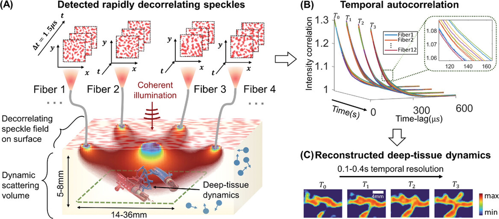
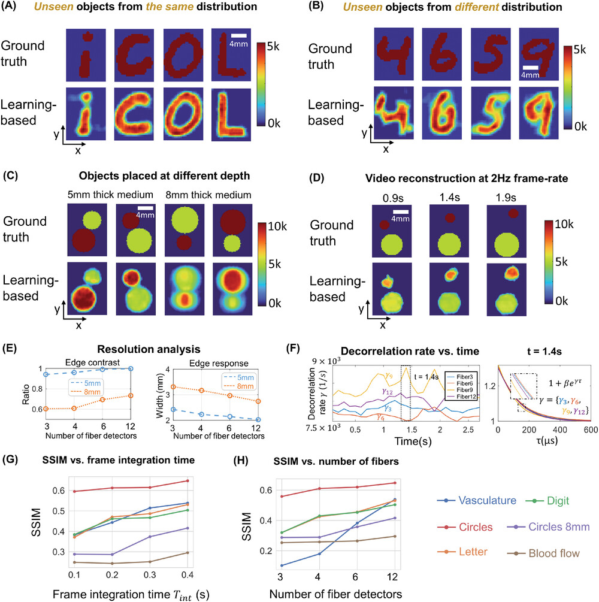
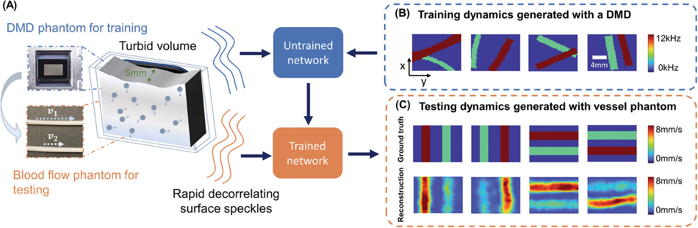

### Imaging Dynamics Beneath Turbid Media via Parallelized Single-Photon Detection

[Paper](https://doi.org/10.1002/advs.202201885)

## Summary

Noninvasive optical imaging through dynamic scattering media has numerous important biomedical applications but still remains a challenging task. While standard diffuse imaging methods measure optical absorption or fluorescent emission, it is also well-established that the temporal correlation of scattered coherent light diffuses through tissue much like optical intensity. Few works to date, however, have aimed to experimentally measure and process such temporal correlation data to demonstrate deep-tissue video reconstruction of decorrelation dynamics. In this work, a single-photon avalanche diode array camera is utilized to simultaneously monitor the temporal dynamics of speckle fluctuations at the single-photon level from 12 different phantom tissue surface locations delivered via a customized fiber bundle array. Then a deep neural network is applied to convert the acquired single-photon measurements into video of scattering dynamics beneath rapidly decorrelating tissue phantoms. The ability to reconstruct images of transient (0.1–0.4 s) dynamic events occurring up to 8 mm beneath a decorrelating tissue phantom with millimeter-scale resolution is demonstrated, and it is highlighted how the model can flexibly extend to monitor flow speed within buried phantom vessels.

*Figure 1. The experimental setup and results of the human prefrontal cortex activation test. (a) The schematic diagram of the experimental setup. (b) The plot of the decorrelation time values over the 15 min test including two reading stages and one intermediate rest stage, where 10 s of the signal is collected every minute. (c) The plot of mean decorrelation time corresponding to (b). Each mean decorrelation time value is obtained by averaging all the decorrelation time values within the corresponding 10 s window. (d) Mean ± SD results of the mean decorrelation time of 4 subjects calculated after dividing the data of each subject by the average decorrelation value of their respective measurement sequence. Solid horizontal lines represent the average of the five normalized decorrelation times in each stage.*

## Results
we tested the ability of PaDI to resolve decorrelation speed maps that vary as a function of space and at different phantom tissue depths. PaDI reconstructions for two variable-speed perturbations under both 5 and 8 mm of turbid medium are in Figure 5C. In this experiment, 1280 and 108 patterns of variable speed and shape were utilized for training and testing, respectively. First, we observe that PaDI can spatially resolve features while still maintaining an accurate measure of unique decorrelation speeds. When structures with different decorrelation speeds begin to spatially overlap, the associated reconstructed speed values close to the overlap boundary are either lifted or lowered toward that of the neighboring structure. This is expected, as the detected light travelling through the “banana-shaped” light path contains information integrated over a finite-sized sensitivity region that will effectively limit the spatial resolution of the associated speed map reconstruction. Moreover, we also observed that PaDI reconstructions of dynamics hidden beneath a thicker 8 mm scattering medium are less accurate than those for dynamics beneath a 5 mm scattering medium. A resolution analysis based on the contrast in the edge regions of the circles, and the width of 10–90% edge response is also provided in Figure 5E. Speckle fluctuations sampled by our current configuration on the phantom tissue surface are less sensitive to decorrelation events occurring within deeper region. Creating a PaDI probe with larger source-detector separations can help address this challenge, as detailed in the Section 2.4. Further, we collect continuous data for 3 s, where the dynamic patterns hidden underneath present for 0.3 s, and change every 0.5 s. We show reconstructions of a few frames at Figure 5D. Figure 5F plots four of decorrelation rates change in time. The decorrelation rates are extracted by fitting each autocorrelation curves (using a Levenberg–Marquardt algorithm) with 1 + βeγτ, where τ is delay-time and γ is the decorrelation rates. These autocorrelation curves are used to generate reconstructions in Figure 5D. 3 s continuous measurements are taken, and the curves are estimated using 0.3 s integration window and 66.7% overlap between sliding windows. A set of autocorrelation curves from these four-fiber detection at 1.4 s is presented on the right. 

*Figure 2. PaDI reconstructions of spatiotemporal dynamics for various patterns and decorrelation speeds hidden beneath 5–8 mm thick turbid volume. A) Reconstructions of letter-shaped dynamic scatter patterns hidden underneath 5 mm turbid volume, sampled from a distribution that matches training data distribution. B) Reconstructions of digit-shaped dynamic scatter patterns hidden underneath 5 mm turbid volume, drawn from a different distribution as compared to training data distribution. C) Reconstructions of objects at varying dynamic scattering rate hidden beneath 5 and 8 mm-thick turbid volume, along with E) resolution analyses for different depths using different number of fiber detectors. D) A few reconstruction frames from a video taken over 3 s. F) plots four of decorrelation rates change in time. A set of autocorrelation curves from these four-fiber detection at 1.4 s is presented on the right. G) Plots of average SSIM between ground-truth and reconstructed speed maps as a function of frame integration time Tint for various tested datasets. H) Plots of average SSIM between ground-truth and reconstructed speed maps as a function of number of detection fibers used for image formation. (G) and (H) share the same legend listed at the bottom of the figure.*

We additionally conducted an experiment to study how our model, trained with data generated on our digital phantom, can reconstruct images of the dynamic scattering introduced by more biologically realistic contrast mechanisms. Noninvasive imaging of deep blood flow dynamics, such as hemodynamics within the human brain, is an important application for diffuse optical correlation-based measurements. Accordingly, we modeled deep hemodynamic flow by placing two capillary tubes (3 mm diameter) directly beneath a dynamic scattering volume (same optical properties: μa = 0.01 mm−1, 
) flowing at two different speeds (2.7 and 8.0 mm s−1) via syringe pump injection. After training an image formation model with PaDI data captured on our DMD-based phantom (630 maps of randomly oriented tube-like objects varying at 4–12 kHz), we acquired PaDI data from this unique capillary flow phantom and applied the DMD phantom-trained model to produce images as shown in Figure 6B. Here, we observe reconstructed image measurements of relative flow speed with spatial and temporal structures that match ground truth, pointing toward a system that can potentially image dynamic scattering beneath tissue in vivo using learning-based reconstruction methods trained with more easily accessible synthetic data.

*Figure 3. A) Illustration of deep tissue phantom capillary flow experiment. PaDI network is first trained on synthetic data generated by DMD phantom, then applied to reconstruct images from separate capillary flow phantom setup. B) Examples of dynamic scattering patterns used for training, generated at up to 12 kHz on DMD phantom. C) Representative images reconstructed with proposed learning-based method, along with ground truth. Dynamics are generated with two capillary tubes buried beneath a 5 mm scattering volume exhibiting variable-speed liquid flow.*

## Code
[https://github.com/waltzina/pdci](https://github.com/waltzina/pdci)
